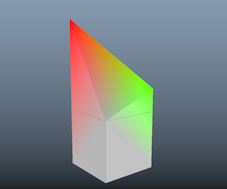

# MeshCompare

A selection of tools to visualize differences between mesh objects.

These are visualized as vertex colors, as can be seen in the image below.
Here we have two cubes, where one cubes vertices have been moved.




The code has two options, one that will work statically and requires no plugin,
while the other is dynamic but requires a plugin.

## Applications

This tool can be useful for scenarios like machine learning deformers
where you may want to visualize the differences between two meshes.

## Usage

### Paramaters

Control the clamp parameter to change the scaling of the coloring.

The clamp value is where you will get a fully red color, and all other colors
are scaled accordingly.


### Python Script

1. Copy the `meshCompare.py` to your Maya scripts folder or anywhere in its `PYTHONPATH`
2. Now you can run the following python

    ```python
    from meshCompare import static_compare
    static_compare('pCube2', 'pCube1')
    ```
    
3. Adjust the `clamp` parameter to affect how strong the coloring is. 
   You can also adjust the `world` parameter to control whether comparisons happen in world space or object space.

### Deformer

The deformer will require to be compiled.
It defaults to Maya 2018 but you can specify a Maya Version by passing the `MAYA_VERSION` parameter to CMake.

Once compiled, pleace the plugin in your Maya plugin path and you can run a similar command

```python
from meshCompare import dynamic_compare
dynamic_compare('pCube2', 'pCube1')
```

# License and Others

The code is available under an MIT license. 

If you have requests or ideas, please put in a pull request or file an issue.
